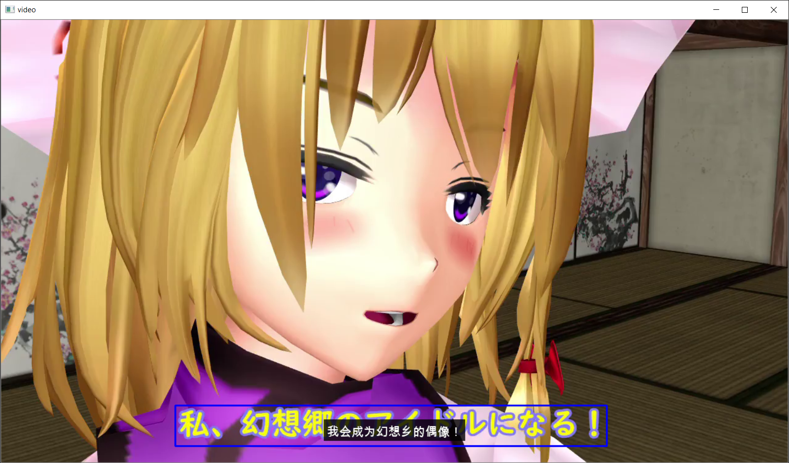

# PYTHON VERSION DEPRECATED
Python version is now deprecated, please use C++ version from [Release](https://github.com/PatchyVideo/MMD-Translator/releases)
# Touhou MMD Subtitle Generator v0.3
Created by [PatchyVideo](https://thvideo.tv)\
Based on [CRAFT](https://arxiv.org/pdf/1904.01941.pdf) scene text detector\
Translation is done using [Google Translate](https://translate.google.com/) with python package [googletrans](https://github.com/ssut/py-googletrans)
# Screenshots

# How to use
You need an NVIDIA GPU no older than GTX 700 series
1. Download `textdet_300k.pth` and `ocr_640k.pth` from [release](https://github.com/PatchyVideo/MMD-Translator/releases/tag/v0.3) and put them into the project folder
1. Install NVIDIA Driver
1. Install CUDA 10.2
1. Install Python3 environment
1. Install PyTorch 1.5.1 from [offical website](https://pytorch.org/)
1. Run `pip3 install -r requirements.txt`
1. Run `python main.py --out NUL --verbose --skip_frame 1 --video /path/to/video/file` and have fun
# How to use in real life
You can specifiy an output srt subtitle file of recognized texts using `--out /path/to/out/srt` parameter\
You can specifiy an output srt subtitle file of translated texts using `--out_translated /path/to/out/srt` parameter\
No windows will be shown if `--verbose` parameter is not given \
`--skip_frame 1` controls how many frames to skip in-between two frames used for recognition, higher the value faster the program will run, but the resulting srt file will not be as accurate as setting this value to 0 \
Use `--language` to specifiy which language you want to translate to, list of language codes can be found [here](https://py-googletrans.readthedocs.io/en/latest/)
# Future works
1. The current text detector is not very accurate, new model is being trained as you are reading this
1. Support Korean
1. Build multithreaded C++ version to fully utilized both CPU and GPU
1. Integrate into [PatchyVideo](https://thvideo.tv) so people can use it online to enjoy Touhou videos made by people speaking another language